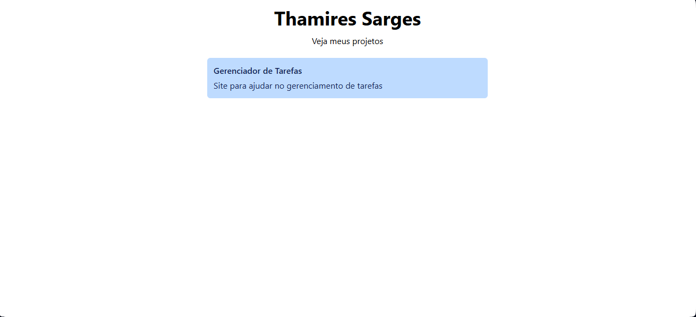
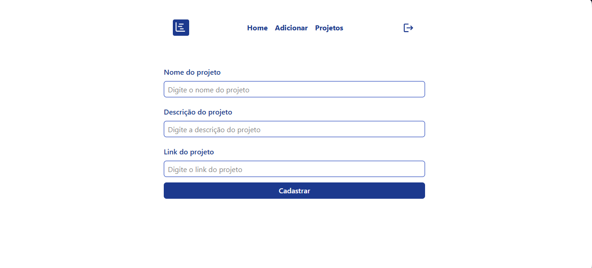
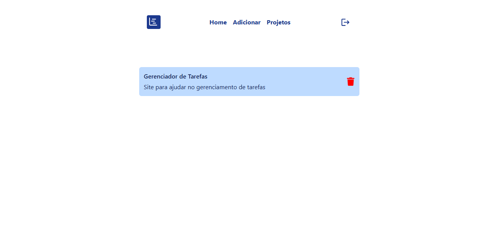

# DevMural

DevMural é uma aplicação web desenvolvida para exibir projetos pessoais de forma simples e organizada.
O sistema possui autenticação de administrador utilizando Firebase Authentication e gerenciamento de projetos com Firebase Firestore.

---

🌐 Deploy
🔗 Acesse o projeto online

Adicione aqui o link da aplicação hospedada na Vercel

🔗 [https://seu-projeto.vercel.app](https://mural-dev.vercel.app)

---

# 📸 Screenshots

## 🏠 Home




---

## 🔐 Login


---

## ⚙️ Painel Admin




---

## 📂 Gerenciamento de Projetos

```md

```

---

# ✨ Funcionalidades

* ✅ Exibição de projetos na Home
* ✅ Login de administrador
* ✅ Rotas privadas
* ✅ Cadastro de projetos
* ✅ Exclusão de projetos
* ✅ Integração com Firebase
* ✅ Atualização em tempo real com Firestore
* ✅ Layout responsivo utilizando TailwindCSS

---

# 🛠️ Tecnologias Utilizadas

## Frontend

* React
* TypeScript
* React Router DOM
* TailwindCSS
* React Icons

## Backend / Serviços

* Firebase Authentication
* Firebase Firestore

---

# 📂 Estrutura do Projeto

```bash
src/
│
├── components/
├── pages/
│   ├── home/
│   ├── login/
│   ├── admin/
│   ├── projects/
│   └── Error/
│
├── routes/
├── services/
├── images/
└── App.tsx
```

---

# 🔥 Configuração do Firebase

Crie um projeto no Firebase e adicione as credenciais no arquivo:

```bash
src/services/firebaseConnection.ts
```

Exemplo:

```ts
const firebaseConfig = {
  apiKey: "SUA_API_KEY",
  authDomain: "SEU_AUTH_DOMAIN",
  projectId: "SEU_PROJECT_ID",
  storageBucket: "SEU_STORAGE_BUCKET",
  messagingSenderId: "SEU_MESSAGING_SENDER_ID",
  appId: "SEU_APP_ID"
};
```

---

# ▶️ Como Executar o Projeto

## Clone o repositório

```bash
git clone https://github.com/seuusuario/devmural.git
```

---

## Acesse a pasta

```bash
cd devmural
```

---

## Instale as dependências

```bash
npm install
```

---

## Execute o projeto

```bash
npm run dev
```

---

# 🔐 Rotas

| Rota              | Descrição                  |
| ----------------- | -------------------------- |
| `/`               | Página inicial             |
| `/login`          | Login do administrador     |
| `/admin`          | Cadastro de projetos       |
| `/admin/projects` | Gerenciamento dos projetos |

---

# 📌 Melhorias Futuras

* [ ] Upload de imagens dos projetos
* [ ] Editar projetos
* [ ] Tema dark mode
* [ ] Melhor feedback visual
* [ ] Dashboard com estatísticas
* [ ] Sistema de categorias/tags

---

# 👩‍💻 Autora

Desenvolvido por **Thamires Sarges** 💙

* LinkedIn: [https://linkedin.com/in/seuperfil](https://www.linkedin.com/in/thamires-sarges/)

---
